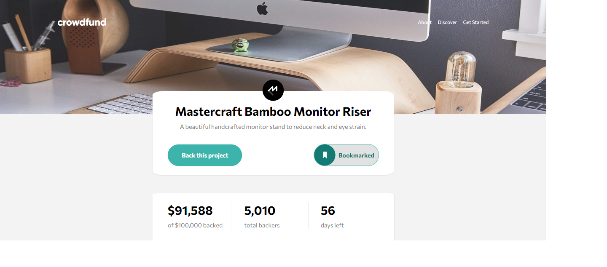

# Frontend Mentor - Crowdfunding product page solution

This is a solution to the [Crowdfunding product page challenge on Frontend Mentor](https://www.frontendmentor.io/challenges/crowdfunding-product-page-7uvcZe7ZR). Frontend Mentor challenges help you improve your coding skills by building realistic projects.

## Table of contents

- [Frontend Mentor - Crowdfunding product page solution](#frontend-mentor---crowdfunding-product-page-solution)
  - [Table of contents](#table-of-contents)
  - [Overview](#overview)
    - [The challenge](#the-challenge)
    - [Screenshot](#screenshot)
    - [Links](#links)
  - [My process](#my-process)
    - [Built with](#built-with)
    - [What I learned](#what-i-learned)
    - [Useful resources](#useful-resources)
  - [Author](#author)

## Overview

### The challenge

Users should be able to:

- View the optimal layout depending on their device's screen size
- See hover states for interactive elements
- Make a selection of which pledge to make
- See an updated progress bar and total money raised based on their pledge total after confirming a pledge
- See the number of total backers increment by one after confirming a pledge
- Toggle whether or not the product is bookmarked

### Screenshot



### Links

- Live Site URL: [View Live site](https://crowd-funding-ten.vercel.app/)

## My process

### Built with

- Semantic HTML5 markup
- CSS custom properties
- Flexbox
- CSS Grid
- Mobile-first workflow
- [React](https://reactjs.org/) - JS library

### What I learned

Getting better using redux

```javascript
const donationsSlice = createSlice({
  name: "Donations",
  initialState,
  reducers: {
    updateSelected(state, action) {
      state.SelectedPlege = action.payload;
    },
    toggleSelection(state) {
      state.isSelectionOpen = !state.isSelectionOpen;
    },
    progressPercent(state) {
      state.progress = (state.currentAmount * 100) / state.targetAmount;
    },
    donate(state, action) {
      state.currentAmount += action.payload.newPledge;
      state.totalBacker += 1;
      const currentProject = state.data.filter(
        (data) => data.id === action.payload.id
      );
      currentProject[0].left -= 1;
    },
    bookmark(state) {
      state.bookmarked = !state.bookmarked;
    },
  },
});
export const {
  updateSelected,
  toggleSelection,
  progressPercent,
  donate,
  bookmark,
} = donationsSlice.actions;
export const reducer = donationsSlice.reducer;

```

scss is **HOT**

```scss
.Cards,
.Cards_disabled,
.Cards_active {
  margin-top: 2rem;
  border: 1px solid lighten($darkGray, 40%);
  border-radius: 1rem;
  padding-block: 1.7rem;
  position: relative;
  cursor: pointer;
  &_head {
    display: flex;
    align-items: center;
    gap: 1rem;
    margin-bottom: 1rem;
    padding-inline: 1.7rem;

    &_checkbox {
      border: 1px solid hsla(0, 0, 0, 0.1);
      border-radius: 50%;
      width: 30px;
      height: 30px;
      display: flex;
      justify-content: center;
      &-checked {
        width: 15px;
        height: 15px;
        align-self: center;

        background-color: $moderateCyan;
        border-radius: 50%;
      }
    }
    &_title {
      display: flex;
      flex-direction: column;
      justify-content: center;
      @media (min-width: $Desktop) {
        flex-direction: row;
        gap: 1rem;
      }
      gap: 0.5rem;
      &_h1 {
        font-size: $fontText;
        @include transition();
        &:hover {
          color: $moderateCyan;
        }
      }
      &_p {
        font-size: $fontText;
        color: $moderateCyan;
        font-weight: 500;
      }
    }
  }
  &_content {
    font-size: $fontText;
    color: $darkGray;
    line-height: 1.7em;
    margin-bottom: 1rem;
    padding-inline: 1.7rem;
  }
  &_left {
    padding-inline: 1.7rem;
    display: flex;
    align-items: center;
    gap: 0.3rem;
    color: $darkGray;
    @media (min-width: $Desktop) {
      position: absolute;
      top: 20px;
      right: 50px;
    }
    span {
      font-size: calc($fontHead - 3px);
      font-weight: 700;
      color: black;
    }
  }
}
```

### Useful resources

- [Gsap ScrollTrigger](https://greensock.com/docs/v3/Plugins/ScrollTrigger) - Best animation libary

## Author

- Frontend Mentor - [@Enx-dev](https://www.frontendmentor.io/profile/Enx-dev)
- Github - [@Enx_Dev](https://github.com/Enx-dev?tab=repositories)
